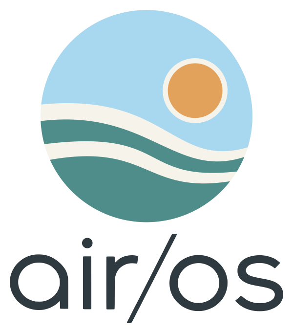

  

air/OS
=======================
**[Haiku upstream](https://www.haiku-os.org/)
| [ROCK 5 ITX guide](docs/rock5-itx/README.md)
| [ROCK 5 status](docs/rock5-itx/STATUS.md)
| [Wireless devices](docs/rock5-itx/WIRELESS-DEVICES.md)
| [Branding](docs/airos/BRANDING.md)**

air/OS is a fork of [Haiku](https://www.haiku-os.org/), the open-source
operating system for personal computing inspired by the BeOS. It keeps
Haiku's fast, simple and coherent desktop and adds what it needs to run on
ARM boards and on hardware that Haiku does not support yet: new drivers,
wireless and Bluetooth Low Energy, and GPU acceleration.

air/OS is forked from Haiku at `hrev60097` (R1/beta6 development) and stays
close to it. The Haiku code, its authors and its licenses are kept as they
are, and *About this system* credits Haiku next to air/OS. This is an
independent, experimental and AI-assisted project; it is not made or endorsed
by Haiku, Inc., and upstream Haiku does not accept AI-assisted contributions.
Haiku® and the HAIKU logo® are registered trademarks of Haiku, Inc.

What air/OS adds
----------------

### ARM64 first
The reference machine is the **Radxa ROCK 5 ITX** (Rockchip RK3588, eight
ARM64 cores). air/OS boots it through UEFI (EDK2) and installs as a full
desktop system on NVMe or eMMC:

 * PCIe host bridge, GICv3 ITS (MSI/MSI-X), NVMe with MSI-X and TRIM, the
   eMMC (SDHCI) as a boot and install target, USB 2.0 host (EHCI), both
   onboard 2.5 GbE ports.
 * `rk3588_display`: native HDMI and DisplayPort output, mode setting,
   hardware cursor, vertical retrace and one desktop spanning both ports.
 * ES8316 analog audio playback and RK3588 hardware video decoding.
 * Correct CPU naming and frequencies, ARM64 cache and page-aging fixes.

### GPU acceleration
 * **Mali-G610 (RK3588):** `mali_csf`, a kernel driver for Arm's
   command-stream-frontend GPUs, with Mesa's Panfrost driver as the system
   OpenGL. Every OpenGL application gets the GPU with no setup; GLTeapot runs
   at the display's 60 Hz.
 * **NVIDIA Pascal (x86_64 workstation branch):** Vulkan and OpenGL 4.5 on a
   GTX 1070/1080 Ti, multiple monitors and H.264 decoding on the card's NVDEC
   engine.
 * **Displays:** per-monitor arrangement and HiDPI scaling in app_server and
   the Screen preferences (100–250%), done in software where a driver cannot
   scale.

### Wireless and Bluetooth
 * A new **Wi-Fi preferences panel** and **WiFiStatus** Deskbar applet: one
   list of networks grouped by name and security, a password prompt,
   *Remember this network*, known networks, disconnect, and joining a saved
   network automatically at boot (`wifiautojoin`).
 * Intel AX210 Wi-Fi 6 (802.11ax) on the ROCK 5, the other M.2, mini PCIe and
   USB Wi-Fi drivers built for ARM64 as well, and a new MediaTek MT7922 driver
   (`mt7922wifi`, x86_64 workstation branch).
 * **Bluetooth Low Energy:** LE scanning and connections, L2CAP fixed
   channels, an ATT client, legacy SMP pairing, a bond store and an LE HID
   mouse input device, with a **BluetoothStatus** applet and reworked
   Bluetooth preferences.
 * `bt_firmware` loads Intel (all btintel generations) and Realtek Bluetooth
   firmware; `h2generic` loads MediaTek MT7921/MT7922 firmware.

### Other additions
 * Network shares: SMB 2/3 shares mounted at boot through `smbfs` (libsmb2),
   configured in Tracker's preferences (x86_64 workstation branch).
 * The air/OS look: icons, Deskbar logo, boot screen, desktop and volume
   artwork, all generated from one source (see
   [docs/airos/BRANDING.md](docs/airos/BRANDING.md)).

Branches
--------

| Branch | What it is |
| --- | --- |
| `rock5-itx` (default) | ARM64 and the Radxa ROCK 5 ITX, plus everything shared |
| `x399-workstation` | x86_64 workstation: Threadripper X399, NVIDIA Pascal, MT7922 |
| `airos-branding` | the air/OS artwork and About window, merged into the above |

Trying and building air/OS
--------------------------
air/OS builds exactly like Haiku; see `ReadMe.Compiling`. For the ROCK 5 ITX,
[docs/rock5-itx/README.md](docs/rock5-itx/README.md) covers the
cross-toolchain, the `@rock5full-mmc` image profile, installation to NVMe or
eMMC and the remote hardware lab. [STATUS.md](docs/rock5-itx/STATUS.md)
records what has been verified on the hardware and what has not.

Hardware support is work in progress. Anything not listed as verified in the
status pages should be treated as untested.

Haiku
-----
Haiku is an open-source operating system that specifically targets personal
computing. Inspired by the BeOS, Haiku is fast, simple to use, easy to learn
and yet very powerful. Its goals, which air/OS shares:

 * Sensible defaults with minimal configuration required.
 * Clean, clear, concise code.
 * Unified desktop environment.

To use or contribute to Haiku itself, go to the
[Haiku website](https://www.haiku-os.org/),
[mailing lists](https://www.haiku-os.org/community/ml),
[issue tracker](https://dev.haiku-os.org/) and
[API docs](https://api.haiku-os.org). Haiku provides
[nightly images](http://download.haiku-os.org/) and
[release images](https://www.haiku-os.org/get-haiku), and its
[patch guidelines](https://dev.haiku-os.org/wiki/CodingGuidelines/SubmittingPatches)
apply to contributions made there, not here.
