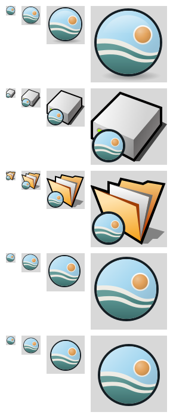

# air/OS branding


The air/OS mark is a disc: sky above a wave, a sun with a cream ring, a teal
band and a teal bottom, separated by cream gaps. The wordmark is `air/os` in
slate. The brand sheet these were taken from is
[`data/artwork/airos/brand-sheet.png`](../../data/artwork/airos/brand-sheet.png).

| Colour | Hex | Use |
| --- | --- | --- |
| Sky | `#A7D8F0` | sky, highlights |
| Breeze | `#4E8D8A` | waves, air/OS headings in *About this system* |
| Dawn | `#E3A25B` | sun |
| Cloud | `#F6F3EA` | gaps, sun ring, wordmark on dark backgrounds |
| Slate | `#2F3A40` | wordmark on light backgrounds |

## Where it appears

| Place | What changed | Source |
| --- | --- | --- |
| Deskbar menu button | mark and wordmark instead of Haiku's feather; a light-text variant on dark panels; centred instead of cut off at the bottom | `src/apps/deskbar/icons.rdef` (`R_LeafLogoBitmap`, `R_LeafLogoDarkBitmap`), `BarMenuBar.cpp`, `BarMenuTitle.cpp` |
| Desktop | the air/OS hills picture, scaled to fill, with outlined icon labels; installed for a new desktop and for one still set to Haiku's default logo (which air/OS does not ship) | `data/artwork/airos/airos-desktop.tga`, `src/kits/tracker/TrackerInitialState.cpp`, `build/jam/packages/Haiku` |
| Boot screen | the air/OS logo above the stage icons; the boot disk stage icon carries the mark | `headers/private/kernel/boot/images-airos.h` (selected in `images.h` for every non-official build), `data/artwork/boot_splash/airos_splash_*.png` |
| Boot volume on the Desktop | Haiku's hard disk with the mark where the leaf (or, in development builds, the bug) was | `src/kits/tracker/TrackerIcons.rdef` (`R_BootVolumeIcon`) |
| `/boot/system` folder | folder with the mark instead of the leaf | `TrackerIcons.rdef` (`R_BeosFolderIcon`) |
| *About this system* | air/OS logo, an air/OS section with the GitHub link above Haiku's own details, which are kept and introduced as what air/OS is forked from; the application icon is the mark | `src/apps/aboutsystem/` |
| Installer | air/OS logo | `src/apps/installer/` |
| DriveSetup | the mark flags the boot partition | `src/apps/drivesetup/icons.h` (`kLeaf`) |
| HaikuDepot | the mark is the "native package" badge | `src/apps/haikudepot/HaikuDepot.rdef` (560) |

The logos in *About this system* and the Installer are vector icons rendered
at a size that follows the font, not PNG resources. arm64 builds have no PNG
or JPEG translator (libpng and libjpeg are not available as arm64 build
packages), so a PNG logo would not show at all; for the same reason the desktop
picture is a run-length encoded TGA.

Left as they are: the Haiku3d demo (it is about the HAIKU letters), the Leaves
screen saver, Haiku's own credits and trademarks in *About this system*, the
Haiku logo artwork in `data/artwork`, and the `.VolumeIcon.icns` that only
Mac-style boot pickers show.

## Icon style

The icons follow Haiku's [icon guidelines](https://www.haiku-os.org/development/icon-guidelines/):
light from the top left, gradients for volume, and a dark outline drawn as a
stroke behind the shape, 4 units wide at normal sizes and 6 units below about
21 pixels. Below a set size the mark switches to a simplified drawing (sky,
one wave, the sun without its ring) through HVIF's level-of-detail shapes, so
it still reads at 16 pixels.



The HVIF files are also in `data/artwork/airos/icons/`, where Icon-O-Matic
can open them.

## Regenerating

Everything above is generated from one description of the mark
(`tools/airos-branding/airos_art.py`, fitted to the brand sheet) and the traced
wordmark (`wordmark_paths.json`):

```sh
jam -q '<build>generate_boot_screen'          # in the build directory
python3 tools/airos-branding/generate.py \
	--boot-screen-tool <build>/objects/linux/x86_64/release/tools/generate_boot_screen
```

It needs Python 3 with pycairo, Pillow and numpy. It rewrites the HVIF data in
the `.rdef` files and `icons.h` in place, the boot screen PNGs and header, the
desktop picture, and the files in `data/artwork/airos/` and `docs/airos/`.
`hvif_render.py` renders HVIF on the host the way `IconRenderer` does, which is
how the contact sheet above is made. `trace_wordmark.py` is the one-off that
traced the wordmark from the brand sheet.


